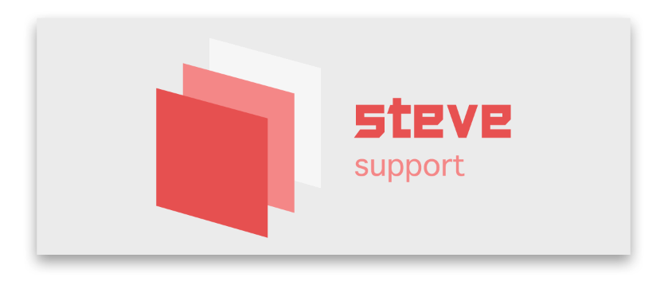

<div align="center">
	
	<br>
	<br>
	<p>
		<sup>If you wanna know more about me, plase to my homepage</sup>
		<br>
		<a href="https://stevecchow.github.io/homepage/">
			
		</a>
	</p>
	<br>
	<br>
</div>


## Project Name

`mallSystem 商城系统`


## Screen Shot


## Build Setup

```bash
# install dependencies
npm install

# serve with hot reload at localhost:8080(开启项目)
npm run start
```


## package.json

```javascript
{
  "name": "SCMallSystem",
  "version": "1.0.2",
  "description": "vue mall cms：vue + mint-ui + mui",
  "author": "stevechow <290689305@qq.com>",
  "private": true,
  "scripts": {
    "dev": "webpack-dev-server --inline --progress --config build/webpack.dev.conf.js --open --hot",
    "start": "npm run dev",
    "build": "node build/build.js"
  },
  "dependencies": {
    "mint-ui": "^2.2.13",
    "vue": "^2.5.2",
    "vue-resource": "^1.5.1",
    "vue-router": "^3.0.1"
  },
  "devDependencies": {
    "autoprefixer": "^7.1.2",
    "babel-core": "^6.22.1",
    "babel-helper-vue-jsx-merge-props": "^2.0.3",
    "babel-loader": "^7.1.1",
    "babel-plugin-syntax-jsx": "^6.18.0",
    "babel-plugin-transform-remove-strict-mode": "0.0.2",
    "babel-plugin-transform-runtime": "^6.22.0",
    "babel-plugin-transform-vue-jsx": "^3.5.0",
    "babel-preset-env": "^1.3.2",
    "babel-preset-stage-2": "^6.22.0",
    "chalk": "^2.0.1",
    "copy-webpack-plugin": "^4.0.1",
    "css-loader": "^0.28.11",
    "extract-text-webpack-plugin": "^3.0.0",
    "file-loader": "^1.1.4",
    "friendly-errors-webpack-plugin": "^1.6.1",
    "html-webpack-plugin": "^2.30.1",
    "less": "^3.9.0",
    "less-loader": "^4.1.0",
    "node-notifier": "^5.1.2",
    "optimize-css-assets-webpack-plugin": "^3.2.0",
    "ora": "^1.2.0",
    "portfinder": "^1.0.13",
    "postcss-import": "^11.0.0",
    "postcss-loader": "^2.0.8",
    "postcss-url": "^7.2.1",
    "rimraf": "^2.6.0",
    "semver": "^5.3.0",
    "shelljs": "^0.7.6",
    "style-loader": "^0.23.1",
    "uglifyjs-webpack-plugin": "^1.1.1",
    "url-loader": "^0.5.8",
    "vue-loader": "^13.3.0",
    "vue-style-loader": "^3.0.1",
    "vue-template-compiler": "^2.5.2",
    "webpack": "^3.6.0",
    "webpack-bundle-analyzer": "^2.9.0",
    "webpack-dev-server": "^2.9.1",
    "webpack-merge": "^4.1.0"
  },
  "engines": {
    "node": ">= 6.0.0",
    "npm": ">= 3.0.0"
  },
  "browserslist": [
    "> 1%",
    "last 2 versions",
    "not ie <= 8"
  ]
}
```


## .babelrc

```javascript
{
  "presets": [
    [
      "env",
      {
        "modules": false,
        "targets": {
          "browsers": [
            "> 1%",
            "last 2 versions",
            "not ie <= 8"
          ]
        }
      }
    ],
    "stage-2"
  ],
  // 用于解除webpack自带的严格模式
  "plugins": [
    "transform-vue-jsx",
    "transform-remove-strict-mode"
  ]
}
```


## License

MIT

