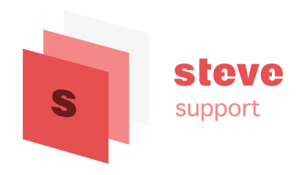

<div align="center">
	
	<br>
	<br>
	<p>
		<sup>If you wanna know more about me, plase to my homepage</sup>
		<br>
		<a href="https://stevecchow.github.io/homepage/">
			
		</a>
	</p>
	<br>
	<br>
</div>

## Project Name

`mallSystem`


## Screen Shot

<div align="center">
	
</div>


## Build Setup

```bash
# install dependencies
npm install

# serve with hot reload at localhost:8080
npm run dev
```


## License

MIT

